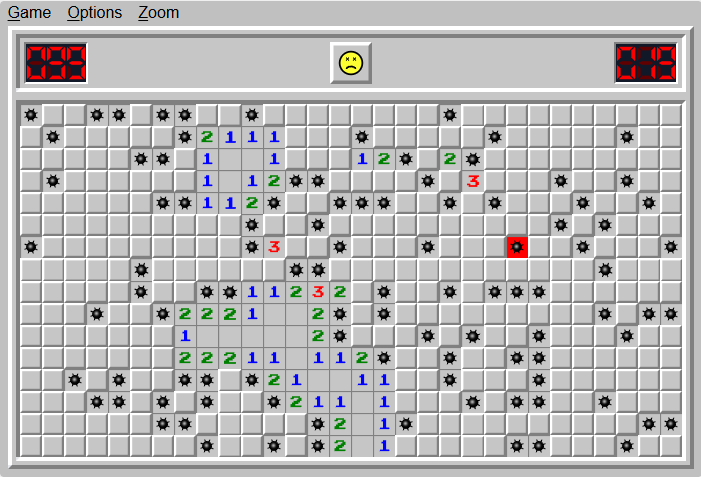

# Classic Color Scheme


### Background Colors
- Main Game Background: #C0C0C0 (Silver)
- Grid Cell Default Background: #808080 (Gray)
- Grid Cell Hover Background: (none in classic mode, leave up to creative discretion of developer implementing it)
- Uncovered Cell Background: #C0C0C0 (Silver)

### Borders
- Grid Cell Border: #000000 (Black)

### Text Colors
- Default Text Color (General Text): #000000 (Black)
- Number Text Colors:
  - 1 (One): #0000FF (Blue)
  - 2 (Two): #008000 (Green)
  - 3 (Three): #FF0000 (Red)
  - 4 (Four): #000080 (Navy)
  - 5 (Five): #800000 (Maroon)
  - 6 (Six): #008080 (Teal)
  - 7 (Seven): #000000 (Black)
  - 8 (Eight): #808080 (Gray)

### Special Elements
- Mine Color: #000000 (Black)
- Flag Color: #FF0000 (Red)

### Game Over States
- Loss Background Color: Standard uncovered mines appear without a distinct background color change. Background of tile changes to a slightly darker red than number 3: d80c0c (Red)
- Win Background Color: No specific color change, only indicated by the game status icon.

---
## Example CSS for Possible Implementation
```css
body {
  background-color: #C0C0C0; /* Main Game Background */
}

.grid-cell {
  background-color: #808080; /* Grid Cell Default Background */
  border: 1px solid #000000; /* Grid Cell Border */
}

.grid-cell.uncovered {
  background-color: #C0C0C0; /* Uncovered Cell Background */
}

.mine {
  color: #000000; /* Mine Color */
}

.flag {
  color: #FF0000; /* Flag Color */
}

.number-1 {
  color: #0000FF; /* Blue */
}

.number-2 {
  color: #008000; /* Green */
}

.number-3 {
  color: #FF0000; /* Red */
}

.number-4 {
  color: #000080; /* Navy */
}

.number-5 {
  color: #800000; /* Maroon */
}

.number-6 {
  color: #008080; /* Teal */
}

.number-7 {
  color: #000000; /* Black */
}

.number-8 {
  color: #808080; /* Gray */
}

.loss-state {
  background-color: #d80c0c; /* Slightly darker red for loss state */
}
```